# ran-kernel-forge


> From bare metal to RAN-ready in under 5 minutes.

Linux kernel profiles and validation containers for 5G/6G RAN workloads. Covers Distributed Unit (DU), Central Unit (CU), and Radio Unit (RU) deployment on COTS x86\_64 and ARM64. Targets sub-1ms scheduling jitter for L1/L2 real-time processing and eCPRI fronthaul synchronization.

---

## Why this exists

5G DU deployments on COTS hardware fail silently when the kernel isn't tuned. Wrong CPU governor, missing `isolcpus`, no hugepages for DPDK: the radio stack starts, processes a few frames, then degrades. The failure shows up as dropped frames and timing violations in the fronthaul, not as a crash.

`ran-kernel-forge` treats kernel readiness like a preflight checklist:

- define per-node-type config fragments (DU, CU, RU)
- validate the running kernel before scheduling the workload
- enforce tuning in CI so bad nodes don't make it to the fleet
- provide apply scripts that merge fragments into any existing `.config`

The profiles are reference implementations for O-RAN.WG4 fronthaul scenarios and 3GPP TS 38.211 DU timing requirements.

---

## What it looks like



Quick mode (config checks, no hardware needed: runs in CI):

```bash
$ docker run --privileged --pid=host \
    ghcr.io/gerardrecinto/ran-kernel-forge-du:latest --quick

[FAIL] PREEMPT_RT kernel active
[PASS] CPU isolation (isolcpus/rcu_nocbs)
[PASS] Hugepages configured
[PASS] irqbalance disabled
[PASS] CPU governor = performance

4/5 checks passed
```

Full validation with cyclictest on a tuned DU node:

```bash
$ sudo python3 tests/latency_check.py --max-latency-us 50

[PASS] PREEMPT_RT kernel active
[PASS] CPU isolation (isolcpus/rcu_nocbs)
[PASS] Hugepages configured
[PASS] irqbalance disabled
[PASS] CPU governor = performance
[PASS] cyclictest p99 <= 50us  (38us)

6/6 checks passed
```

JSON output for pipeline integration:

```bash
python3 tests/latency_check.py --quick --json | jq '.passed, .total'
```

---

## Business impact

5G DU deployments on COTS x86 hardware fail silently when the kernel isn't tuned: wrong governor, missing isolcpus, no hugepages. ran-kernel-forge provides per-node-type kernel config fragments (DU/CU/RU) and a validation container that runs in CI and on the target node before workload scheduling. Catches tuning gaps before the radio stack starts, not after. Built for O-RAN 7.2x fronthaul scenarios where scheduling jitter above 100us causes dropped frames.

---

## Node profiles

| Profile | RT level | Primary workload | Key config |
|---------|----------|-----------------|------------|
| `du` | `PREEMPT_RT` | L1/L2 baseband, PDCP | isolcpus, rcu_nocbs, hugepages, VFIO/DPDK |
| `cu` | `PREEMPT_VOLUNTARY` | RRC, PDCP, SDAP | SR-IOV, BBR, XDP/eBPF, NUMA |
| `ru` | `PREEMPT_RT` | eCPRI/O-RAN 7.2x fronthaul | PTP/IEEE 1588, TSN/ETF, TAPRIO, isolcpus |

---

## Validation checks

| Check | Why it matters |
|-------|---------------|
| `PREEMPT_RT` active | Without it, L1 processing jitter exceeds 3GPP slot budget |
| `isolcpus` / `rcu_nocbs` | OS scheduler and RCU callbacks interrupt RAN CPUs without this |
| Hugepages configured | DPDK PMD requires pre-allocated 2MB or 1GB pages at boot |
| `irqbalance` disabled | irqbalance redistributes IRQs at runtime, spiking latency |
| CPU governor = `performance` | `powersave` governor introduces frequency scaling delays |
| cyclictest p99 | End-to-end scheduling jitter threshold (default 50us) |

---

## Architecture

```text
profiles/
  du-profile.config    cu-profile.config    ru-profile.config
         |                    |                    |
         v                    v                    v
  scripts/apply-profile.sh  (merge into kernel .config)
         |
         v
  Kernel build with RT patches
         |
         v
  Deployed node (COTS x86_64 or ARM64)
         |
         v
  scripts/tune-hugepages.sh
  scripts/tune-irq-affinity.sh
  scripts/tune-cpu-isolation.sh
         |
         v
  tests/latency_check.py  <-- runs in CI and on target node
         |
         v
  Pass: schedule RAN workload
  Fail: block deployment, page on-call
```

Containers (`containers/du/`, `containers/cu/`, `containers/ru/`) ship the tuning scripts and validator pre-installed. Run with `--privileged --pid=host` for full kernel visibility.

---

## Quick start

### Pull and run the validator

```bash
# DU node pre-flight
docker run --privileged --pid=host \
  ghcr.io/gerardrecinto/ran-kernel-forge-du:latest

# CU node pre-flight
docker run --privileged --pid=host \
  ghcr.io/gerardrecinto/ran-kernel-forge-cu:latest

# RU node pre-flight (PTP/TSN fronthaul)
docker run --privileged --pid=host \
  ghcr.io/gerardrecinto/ran-kernel-forge-ru:latest
```

### Clone and run locally

```bash
git clone https://github.com/gerardrecinto/ran-kernel-forge
cd ran-kernel-forge
python3 tests/latency_check.py --quick
```

### Apply a kernel config fragment

```bash
# On the target node with kernel source available
sudo ./scripts/apply-profile.sh profiles/du-profile.config /usr/src/linux
cd /usr/src/linux && make olddefconfig && make -j$(nproc)
```

---

## Tuning scripts

```bash
# 1. Hugepages (2GB = 1024 x 2MB, required for DPDK)
sudo ./scripts/tune-hugepages.sh 1024 2048

# 2. Pin all IRQs to housekeeping CPUs 0-1
sudo ./scripts/tune-irq-affinity.sh "0,1" eth0

# 3. Validate isolation and set performance governor
sudo ./scripts/tune-cpu-isolation.sh
```

For persistent CPU isolation, add to `GRUB_CMDLINE_LINUX` and reboot:

```
isolcpus=2-N rcu_nocbs=2-N nohz_full=2-N intel_pstate=disable
```

---

## Docker images

```bash
docker pull ghcr.io/gerardrecinto/ran-kernel-forge-du:latest
docker pull ghcr.io/gerardrecinto/ran-kernel-forge-cu:latest
docker pull ghcr.io/gerardrecinto/ran-kernel-forge-ru:latest
```

Images are published for `linux/amd64` and `linux/arm64`. Build provenance and SBOM attestations are embedded in each image via OCI referrers.

---

## Repo structure

```
ran-kernel-forge/
├── profiles/
│   ├── du-profile.config     # DU: PREEMPT_RT, isolcpus, DPDK/VFIO, hugepages
│   ├── cu-profile.config     # CU: PREEMPT_VOLUNTARY, SR-IOV, BBR, XDP
│   └── ru-profile.config     # RU: PREEMPT_RT, PTP/1588, TSN, TAPRIO
├── containers/
│   ├── du/Dockerfile
│   ├── cu/Dockerfile
│   └── ru/Dockerfile
├── scripts/
│   ├── tune-hugepages.sh
│   ├── tune-irq-affinity.sh
│   ├── tune-cpu-isolation.sh
│   └── apply-profile.sh
├── tests/
│   ├── latency_check.py      # Kernel readiness checker with cyclictest integration
│   └── test_checks.py        # Unit tests for check functions (pytest)
└── .github/workflows/
    ├── ci.yml                 # Profile validation, shellcheck, pytest, quick check
    └── release.yml            # Multi-arch GHCR publish + provenance on v* tags
```

---

## Development

```bash
git clone https://github.com/gerardrecinto/ran-kernel-forge
cd ran-kernel-forge

# Lint, SAST, and unit tests
pip install -r requirements-dev.txt
ruff check tests/ && bandit -r tests/ -ll && pytest tests/test_checks.py -v
sudo apt install shellcheck && shellcheck scripts/*.sh

# Validate profiles
grep -q 'CONFIG_PREEMPT_RT=y' profiles/du-profile.config
grep -q 'CONFIG_PTP_1588_CLOCK=y' profiles/ru-profile.config

# Run quick check
python3 tests/latency_check.py --quick --json
```

---

## Use cases

- Pre-flight validation before deploying 5G DU workloads on bare metal or edge nodes
- O-RAN CU/DU/RU split deployment on Qualcomm, Intel, or COTS x86/ARM64 platforms
- CI gate in RAN node provisioning pipelines (Ansible, Terraform, Helm)
- MWC demo: reproduce standard DU kernel tuning from cold node in under 5 minutes
- Lab setup validation before handing over to RF/L1 integration teams

---

## Why this is different from a distro RT package

Distributions ship general-purpose RT kernels. RAN workloads need node-type-specific tuning: a DU needs different isolcpus and hugepage sizing than a CU, and an RU needs PTP + TSN that neither the DU nor CU profile enables. This repo gives you composable config fragments per role, not one monolithic RT config.

The validator is also deployable in CI: you don't need a tuned node to catch a misconfigured kernel profile during development.

---

## License

MIT
